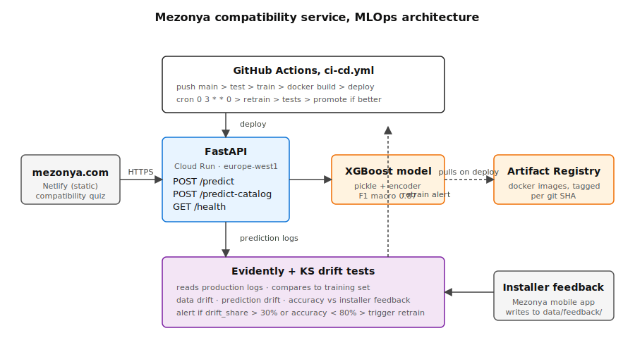

# mezonya-ml

[](https://github.com/loredane/mezonya-ml/actions/workflows/ci-cd.yml)
[](https://www.python.org/)
[](LICENSE)

ML service that predicts compatibility between smart-home devices. Powers the product-picker on [mezonya.com](https://mezonya.com).

Given two devices (brand, category, connectivity protocols, ecosystems, hub and cloud requirements), the model returns one of three labels, `compatible`, `partial`, `incompatible`, plus a confidence score and a plain-text reason.

## Why

The catalog has a few hundred devices. Compatibility is non-trivial: a Zigbee sensor needs a Zigbee hub, a HomeKit-only camera won't talk to an Alexa-only doorbell, a cloud-required device paired with a cloud-required device creates a single point of failure. Mapping every pair by hand doesn't scale, N devices means N² pairs. A model trained on installer-validated pairs generalizes the rules.

## Architecture



- **Frontend** (`mezonya.com`, Netlify static site) calls the API from the compatibility quiz and product pages.
- **API** (FastAPI on Cloud Run, `europe-west1`) loads the model on startup and serves predictions.
- **Training** happens in CI. Artifacts are versioned in Artifact Registry via the Docker image tag.
- **Retraining** runs weekly via GitHub Actions. If the new model beats the live one on F1 macro, it's promoted automatically; otherwise the old model is kept.
- **Monitoring** compares live prediction distributions against the training set via Kolmogorov-Smirnov tests (or Evidently when available). Drift beyond 30% of features triggers an alert.

## Tech choices

| | choice | why |
|---|---|---|
| model | XGBoost | tabular data, small dataset (4950 pairs), feature-importance for installer trust |
| serving | FastAPI | async, OpenAPI out of the box, pydantic validation |
| deployment | Cloud Run | scale-to-zero, pay-per-request, one YAML to deploy |
| ci/cd | GitHub Actions | same repo, no extra infra |
| monitoring | Evidently + KS fallback | open source, no SaaS lock-in |
| tracking | MLflow (optional) | standard, swappable |

### Alternatives considered

- **Airflow / Kubeflow for scheduled retraining**: overkill here. The retrain job is a single task that runs weekly; GitHub Actions cron does the same thing with zero infrastructure. Worth revisiting if we ever chain it with upstream data ingestion DAGs.
- **DVC for dataset / model versioning**: the dataset is small enough (70 KB CSV, 1.4 MB model) to sit in Git alongside the code. Artifact Registry versions the Docker image per SHA, which is the rollback unit that matters in practice. DVC makes sense at the point where the raw data outgrows Git LFS.
- **Neural net instead of XGBoost**: tried in the exploration notebook. Wins by less than 1 point of F1, loses all interpretability. Not worth it at this dataset size.

## Accessibility

The API was designed with [WCAG 2.1](https://www.w3.org/TR/WCAG21/) in mind so that the frontend team can build an inclusive quiz:

- Every prediction includes a plain-text `reason` field. The frontend renders it as the ARIA label of the result badge, so screen readers announce *"Aqara and Philips work together with limitations. Shared protocols: zigbee, wifi."* instead of just "partial".
- Results never rely on color alone, the API returns a discrete label (`compatible` / `partial` / `incompatible`) so the UI can combine color with an icon and text.
- The OpenAPI spec is generated automatically and is readable by assistive tech (served at `/docs` and `/redoc`).

See [`docs/ACCESSIBILITY.md`](docs/ACCESSIBILITY.md) for the full checklist.

## Repo layout

```
api/main.py                 FastAPI app
scripts/train.py            train XGBoost on the current dataset
scripts/retrain.py          scheduled retrain, promote if better
scripts/monitor.py          drift + quality report
data/generate_dataset.py    builds pairs from device_catalog.json
data/collectors/            collect new devices from Home Assistant / Matter
tests/test_model.py         pytest: smoke, golden set, API
models/                     model.pkl, metrics.json, model_config.json
docs/                       architecture, API reference, dataset notes
notebooks/exploration.ipynb training notebook with hyperparameter tuning
.github/workflows/ci-cd.yml build-test-deploy + weekly retrain
```

## Quickstart

```bash
pip install -r requirements.txt

python data/generate_dataset.py           # builds dataset + catalog
python scripts/train.py                    # trains, writes models/
pytest tests/                              # runs model + API + retrain + monitor tests
uvicorn api.main:app --reload              # serves on :8000
```

Explore the modeling decisions in `notebooks/exploration.ipynb`:

```bash
pip install jupyter matplotlib
jupyter notebook notebooks/exploration.ipynb
```

Try it:
```bash
curl -X POST http://localhost:8000/predict -H "Content-Type: application/json" -d '{
  "device_a": {"brand": "Aqara", "category": "security",
               "connectivity": ["zigbee","wifi"],
               "ecosystems": ["apple","google","alexa"],
               "hub_required": false, "cloud_dependency": "optional"},
  "device_b": {"brand": "Philips", "category": "lighting",
               "connectivity": ["zigbee","wifi"],
               "ecosystems": ["apple","google","alexa"],
               "hub_required": true, "cloud_dependency": "optional"}
}'
```

## Endpoints

| method | path | purpose |
| --- | --- | --- |
| `GET` | `/health` | liveness probe; returns `{status, model_loaded}` |
| `POST` | `/predict` | compatibility for a single device pair |
| `POST` | `/predict-catalog` | rank the catalog against one device (self-match excluded) |

Interactive docs: `/docs` (Swagger UI) and `/redoc` once the API is running.

## Configuration

All runtime config is via environment variables. Defaults work for local dev.

| variable | default | used by | purpose |
|---|---|---|---|
| `MODEL_DIR` | `models` | api, retrain | directory containing `model.pkl`, `category_encoder.pkl`, `model_config.json` |
| `CATALOG_PATH` | `data/device_catalog.json` | api | the catalog used by `/predict-catalog` |
| `PREDICTION_LOG_PATH` | `data/production_predictions.jsonl` | api | JSONL file where every prediction is logged for monitoring |
| `PORT` | `8080` | Dockerfile | Cloud Run injects this at runtime |

## Deployment

Cloud Run, GCP, region `europe-west1`. The GitHub Actions workflow handles everything on push to `main`.

**One-time setup:**

```bash
gcloud artifacts repositories create mezonya-docker \
  --repository-format=docker \
  --location=europe-west1

# service account for CI
gcloud iam service-accounts create github-deployer
gcloud projects add-iam-policy-binding $PROJECT \
  --member=serviceAccount:github-deployer@$PROJECT.iam.gserviceaccount.com \
  --role=roles/run.admin
gcloud projects add-iam-policy-binding $PROJECT \
  --member=serviceAccount:github-deployer@$PROJECT.iam.gserviceaccount.com \
  --role=roles/artifactregistry.writer
```

Add these secrets in the GitHub repo settings:
- `GCP_PROJECT_ID`
- `GCP_SA_KEY`, JSON key for the service account above

After that, every `git push origin main` runs: tests to train to docker build to deploy. The API URL is in the Cloud Run console.

## Retraining

Runs automatically every Sunday at 03:00 UTC (GitHub Actions schedule). Flow:

1. Pull any new installer feedback from `data/feedback/*.csv`
2. Merge with the existing dataset, dedupe on `(device_a_id, device_b_id)` keeping the latest label
3. Train a fresh model with the same hyperparameters
4. Run the full test suite against it
5. **Promote only if** F1 macro >= 0.85 and F1 macro >= current model. Otherwise keep the old model.
6. Commit the new artifacts back to the repo

Rollback is a git revert of the artifacts commit, the previous `model_backup_<timestamp>.pkl` is still on disk.

See [`docs/DATASET.md`](docs/DATASET.md) for the full data pipeline, [`docs/MODEL_CARD.md`](docs/MODEL_CARD.md) for model provenance and limitations, and [`docs/API.md`](docs/API.md) for the API reference.

## License

Proprietary. See [`LICENSE`](LICENSE).
